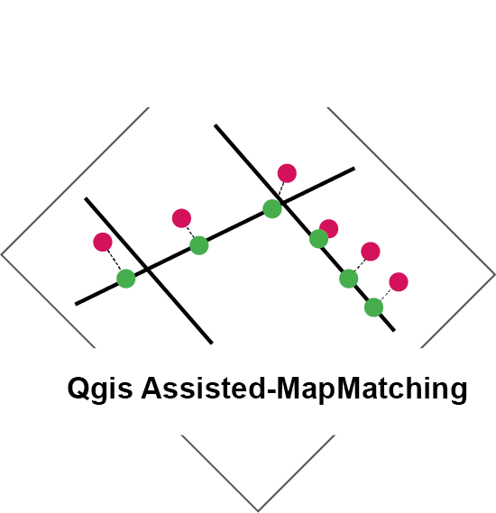

# Assisted-MapMatching 

A QGIS plugin to semi-automatically adjust a GPS track on a street network (map-matching).
 
The matching is based on the Leuven.MapMatching library.

## Installation

First of all you need to open the window "Manage and Install Plugins" in the Plugins option.  

Then enter "Assisted-MapMatching" in the searching tab, select the plugin with the same name.

Click on install plugin (bottom-right).

Once it's installed, you can start it by clicking on the icon that appeared in the QGIS plugin tab.

## Version and Dependencies

Plugin developped on QGIS 3.18.0.

Dependencies: 

- [shapely](https://pypi.org/project/Shapely/) 
(Already installed on QGIS windows. You need a version lower than 1.5.17 for linux.)

## Authors
Jordy Gelb, Laboratoire d’équité Environnementale, INRS (Montréal, Canada), Email: jordygelb@gmail.com
## Contributors
Jeremy Gelb, Laboratoire d’équité Environnementale, INRS (Montréal, Canada), Email: jeremy.gelb@ucs.inrs.ca  
David Maignan, Laboratoire d’équité Environnementale, INRS (Montréal, Canada), Email: davidmaignan@gmail.com 
Philippe Apparicio, Laboratoire d’équité Environnementale, INRS (Montréal, Canada), Email: philippe.apparicio@ucs.inrs.ca

## About the plugin

Matching a GPS track on a street network is currently a laborious work. You need to select manually every points and place it on the correct segment.
This plugin semi-automatically map-matches your points on your network layer and then allows you to modify the result manually.  

The plugin is divided into three parts:  

- ### **The Data preparation**. 

This first step prepares the data to avoid bugs in the map-matching algorithms. It corrects the topology of the street network and verify the validity of the input.

Four fields needs to be filled:
- The street network layer. It represent the road network on which you want to adjust your GPS track. The list shows every active layer of type **LineString**.  
Check that it's SCR is the same as the Path layer one and that it's unit is meter.

- The GPS trace layer. It represent the GPS track that you want to adjust to a network. The list shows every active layers of type **Point**.  
Check that it's SCR is the same as the Path layer one and that it's unit is meter.

- The point identifier. This field must be an unique identifier of every points and is used to order them. The list shows every attributes of type "Integer/Integer64/int/int8" in the selected GPS trace. 

- The buffer range. It represent the maximum distance to find lines on the selected network for each trajectory point. The bigger this value is, the longest the computing time.

Two functionnalities are necessary to access the next step:
- Reduce the network: It reduces the number of lines present in the selected network by creating a buffer around every point of the selected GPS track and then saving every lines intersecting the buffer. Once done a new QGSVectorLayer stocked in memory is created and added to the interface.
- Correct the topology : It corrects the topology of the reduced street network to prevent future errors during the map-matching phase. Four case are treated:
    - The presence of *loop* in the network. A loop is a geometry with it's two extremities touching each other. We split it in two at it's center.
    - The presence of *dangle nodes*. A dangle node represent the case where an extremity of a line is touching another line. We split the touched line in two part at it's contact point.
    - The presence of *intersection*. We split the two lines intersecting each other in two at their crossing point giving 4 lines in output.
    - The presence of *close call*. A close call represents the case where 2 extremities of two lines are really close (<= 1cm) but doesn't touch each other. We merge the two points.

This first step prepares the data to facilitate the work of the map-matching algorithms. It corrects the topology of the street network and verify the validity of the input.
Four fields require to be filed and two actions need to be done in order to access to the next step.
The fields are:
- The dropDown list Network layer. It show every layer of type **LineString** that are active on QGIS. Select the road network on which you want to adjust your GPS track. Check that it's SCR is the same as the Path layer one and that it's unit is meter
- The dropDown list GPS trace layer. It show every layers of type **Point** that are active on QGIS. Select the GPS track that you want to adjust to a network. Check that it's SCR is the same as the Path layer one and that it's unit is meter
- The dropDown list OID (Object indentifier). It show every attributes of type "Integer/Integer64/int/int8" present in the selected GPS trace. This field must be an unique identifier of every points and is used to order them. A point present earlier on the trace must have a smaller number than another present later.
- The slider Buffer range. It represent the maximum distance to find lines on the selected network for each trajectory point. The bigger this value is, the longest the computing time

Two functionnalities are obligatory to access the next step:
- Reduce the network : This functionnality reduce the number of lines present in the selected network. It creates a buffer around every point of the selected GPS track and then save every lines intersecting the buffer. Once done a new QGSVectorLayer stocked in memory is created and added to the interface.
- Correct the topology : This functionnality correct potential the topology of the reduced network to prevent future errors during the map-matching phase. Four case are treated:
- The presence of *loop* in the network. A loop is a geometrie with it's two extremities touching each other. We split it in two at it's center.
- The presence of *dangle nodes*. A dangle represent the case where an extremity of a line is touching another line. We split the touched line in two part at it's contact point.
- The presence of *intersection*. We split the two line intersecting each other in two at their crossing point giving 4 lines in output.
- The presence of *close call*. A close call represent the case where 2 extremities of two lines are really close (<= 1cm) but doesn't touch each other. We merge the two points.

    
The user can modify parameters in the second tab.

- ### **The MapMatching**

This step matches the points of the GPS trace on the network. If the map-matching algorithm made a mistake, the user can correct it by selecting the path used manually and applicate the changes. (that will restart the map-matching algorithm on the new selection.)
Two field can be completed:

- The speed. Select the element representing the speed at which every point has been taken. The list shows every attributes of type "Integer/Integer64/int/int8" present in the selected GPS trace. This field is only necessary if you use the mapmatching method "by speed".

- The MapMatching algorithm. This list allows you to choose the type of matching. Three options are available.

    - By speed: Taking into account the speed, the GPS trace is cutted into mooving or stopped section. Every points of a stopped section are merged at their average location and snapped to their closest location on the selected line on the network. The mooving section are then adjusted between the sections separated by the groups of stopped point.

    - By distance: This method adjust the points along the path by taking into account the distance between every points and the ratio between the length of the original track (in between each points), and the path selected.

    - To closest: This methode simply project every points to the closest road on the selected path.

- ### **The Export**
This step allows you to export your datas to the selected format. You can also do it manually from QGIS.
Three options are available:

- Export the result. This option allows you to export the selected matched track present in the list (on the left) to the format specified in the settings.

- Export the polyline. This option allows you to export the polyline representing the path used by the cyclist.

- Export project. This option allow you to export every elements coched in the settings inside a single file. 

## Demonstration gif

## How to report a Bug
if you found a bug and it can't be corrected by the section below's, please, create an issue on the github with: Your plateforme, your QGIS version, a description of the problem and every elements that could help us reproducing it.

The plugin isn't working? Here is a few tips to correct some error that might happen during the process:
- Check that your two layers are active (checked) or they won't be detected.
- Check that your two layers geometry's type are LineString for one and Point for the other. MultilineString isn't supported by the plugin. A section is dedicated to it in the Data preparation part.
- Check that your two layers are in the same projection system (SCR) and that they are both in meter (cartesian). You can reproject your layer with the QGIS tool: Vector->Data Management Tools->Reproject layer...
-  Check that your GPS trace layer has an identifier conform to the documentation standards (unique, integer...).
- Try reloading if you corrected the precedent error and nothing appeared in the combobox.
- Never delete a layer during the process or the plugin will force you to start again.
- Your map layer isn't complete and the algorithm couldn't find a connection between two part of the path. Don't hesitate to increase the searching radius of the algorithm. You can also add a segment manually to complete your network.
- The map matching parameter searching radius is too low and couldn't detect potential roads.
- The module processing isn't activated on your version of QGIS. Please check the box in: Plugins->Manage and Install Plugin, Installed->Processing
   

## License
GNU GENERAL PUBLIC LICENSE, Version 3, 29 June 2007